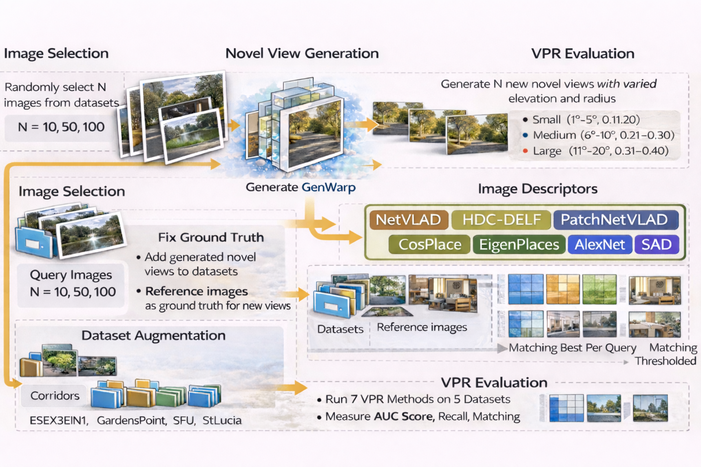

# Systematic Evaluation of Novel View Synthesis for Video Place Recognition

<p align="center">
  <strong>Muhammad Zawad Mahmud &nbsp;·&nbsp; Samiha Islam &nbsp;·&nbsp; Damian Lyons</strong><br>
  <sub>Dept. of Computer & Information Science, Fordham University, NY USA</sub><br>
  <sub>mmahmud9@fordham.edu</sub>
</p>

<p align="center">
  <a href="https://arxiv.org/abs/2603.05876"></a> &nbsp;
  <a href="#results"></a> &nbsp;
  <a href="https://github.com/sony/genwarp/"></a> &nbsp;
  <a href="https://github.com/stschubert/VPR_Tutorial"></a>
</p>

---

> **TL;DR** — We systematically evaluate whether generative novel view synthesis (via [GenWarp](https://github.com/sony/genwarp/)) can augment VPR datasets and improve robot place recognition. Small injections improve performance; large ones degrade it — but viewpoint angle matters far less than injection count and scene type.

---

## Table of Contents
- [Overview](#overview)
- [Repository Structure](#repository-structure)
- [Setup](#setup)
- [Datasets](#datasets)
- [Generating Novel Views & Running Evaluation](#generating-novel-views--running-evaluation)
- [VPR Evaluation](#vpr-evaluation)
- [Adapting to Other Configurations](#adapting-to-other-configurations-10--50--100-views)
- [Results](#results)
- [Citation](#citation)
- [Acknowledgements](#acknowledgements)

---

## Overview

This repository accompanies the paper:

> **Systematic Evaluation of Novel View Synthesis for Video Place Recognition**  
> *Submitted to IEEE IROS 2026.*

We investigate whether synthetic novel views generated from single images can be injected into VPR datasets to improve place recognition — a proxy for evaluating whether novel view synthesis is useful for robot navigation (e.g., ground-to-aerial view matching).

**Key findings:**
- ✅ Small injections (~10 views) with small viewpoint changes **improve** AUC metrics
- ⚠️ Large injections (~100 views) **degrade** performance by up to 8%
- 🔁 Viewpoint magnitude (up to 20°) has **little effect** — injection count matters more
- 🏆 **PatchNetVLAD** is the most robust descriptor under novel view augmentation
- 🌿 Scene complexity (natural/mixed vs. structural) affects results more than injection %

We use [**GenWarp**](https://github.com/sony/genwarp/) (NeurIPS 2024) to generate novel views from single images, and the [**VPR Tutorial**](https://github.com/stschubert/VPR_Tutorial) framework for evaluation.

<!-- 
  IMAGE 1: Pipeline / concept figure
  Suggested: a side-by-side showing (left) query image → GenWarp → novel views, 
  then those views being matched in the VPR framework.
  Replace the src below with your actual image path or URL.
-->


---

## Repository Structure

```
nvs-vpr-eval/
├── images/                  # VPR dataset images (5 datasets)
├── datasets/                # Ground truth and dataset metadata
├── feature_extraction/      # Image descriptor extraction modules
├── feature_aggregation/     # Descriptor aggregation methods
├── matching/                # Image matching logic
├── evaluation/              # AUC and recall metric computation
├── output_images/           # Visualizations: PR curves, matchings, TP/FP examples
├── demo.py                  # Main entry point — runs full VPR evaluation pipeline
├── mapping.json             # Query-to-reference mapping for injected novel views
├── dataset                  # Dataset config/loader
├── setup.py                 # Package setup
├── requirements.txt         # Python dependencies
├── .gitmodules              # Submodule references (GenWarp)
└── README.md
```

This repo is a modified version of the [VPR Tutorial](https://github.com/stschubert/VPR_Tutorial), extended with two additional datasets (Corridor and ESSEX3IN1) and novel view injection support via [GenWarp](https://github.com/sony/genwarp/).

---

## Setup

### 1. Set Up GenWarp

First, clone and set up GenWarp by following their [official instructions](https://github.com/sony/genwarp/). This includes installing dependencies, cloning ZoeDepth, and downloading model checkpoints.

### 2. Get the Novel View Generation Notebook

Clone this repo and copy `VPR.ipynb` into GenWarp's examples folder:

```bash
git clone https://github.com/zawadsadat/nvs-vpr-eval.git
cp nvs-vpr-eval/VPR.ipynb genwarp/examples/
```

Open `genwarp/examples/VPR.ipynb`, set the input directory to your dataset path at the top of the notebook, and run all cells to generate novel views.

---

### 3. Set Up the VPR Evaluation Code

Our evaluation code follows the same structure as the [VPR Tutorial](https://github.com/stschubert/VPR_Tutorial) by Schubert et al. Clone our modified version:

```bash
git clone https://github.com/zawadsadat/nvs-vpr-eval.git
cd nvs-vpr-eval
```

#### Install dependencies

The code was tested with the library versions listed in `requirements.txt`. Install via pip:

```bash
pip install -r requirements.txt
```

Or create a conda environment:

```bash
mamba create -n nvs-vpr python numpy pytorch torchvision natsort tqdm opencv pillow scikit-learn faiss matplotlib-base tensorflow tensorflow-hub tqdm scikit-image patchnetvlad -c conda-forge
```

#### Run the evaluation

```bash
python3 demo.py --dataset GardensPoint  --descriptor NetVLAD
```

You should see output similar to:

```
========== Start VPR with NetVLAD descriptor on dataset GardensPoint
===== Load dataset GardensPoint day_right--night_right
===== Compute reference set descriptors
===== Compute query set descriptors
===== Compute cosine similarities S
===== Match images
===== Evaluation
Saved: output_images/examples_tp_fp.jpg
Saved: output_images/matching_best_per_query.jpg
Saved: output_images/matching_thresholded.jpg
Saved: output_images/pr_curve.jpg

===== AUC (area under curve): 0.190

===== R@100P (maximum recall at 100% precision): 0.01

===== recall@K (R@K) -- R@1: 0.168, R@5: 0.480, R@10: 0.676
```

---

## Datasets

We use five publicly available VPR datasets covering a range of indoor and outdoor imagery:

| Dataset | Type | # Query | # Reference |
|---|---|---|---|
| **GardensPoint** | Outdoor (structured) | 200 | 200 |
| **SFU** | Outdoor (campus) | 385 | 385 |
| **StLucia** | Outdoor (natural/urban) | 200 | 200 |
| **Corridor** | Indoor | 111 | 111 |
| **ESSEX3IN1** | Indoor/Outdoor mixed | 210 | 210 |

---

## Novel View Injection Settings

### Injection size options

| `NUM_VIEWS` | Description | % of GardensPoint added |
|---|---|---|
| `10` | Small injection | 5% |
| `50` | Medium injection ← *default* | 25% |
| `100` | Large injection | 50% |

### Elevation/viewpoint options

| `ELEVATION` | φ, ψ range | r range |
|---|---|---|
| `"small"` | 0° – 5° | 0.01 – 0.10 |
| `"medium"` | 5° – 10° ← *default* | 0.11 – 0.20 |
| `"large"` | 10° – 20° | 0.21 – 0.30 |

---

## VPR Evaluation

We provide a modified version of the [VPR Tutorial](https://github.com/stschubert/VPR_Tutorial) repository for evaluation. The structure follows the original VPR Tutorial exactly, with the following changes:

- **Two additional datasets** added: Corridor and ESSEX3IN1 — placed under `images/` alongside the original three (GardensPoint, SFU, StLucia)
- **`demo.py`** — updated to support all five datasets
- **`load_dataset.py`** — updated to load the two new datasets
- **Ground truth files** — added for Corridor and ESSEX3IN1
- **Novel view injection script** — randomly selects N images from the query (or reference) set, generates novel views using GenWarp, and injects them back into the dataset

**The `images/` folder structure:**
```
images/
├── GardensPoint/
├── SFU/
├── StLucia/
├── Corridor/        ← added
└── ESSEX3IN1/       ← added
```

The version provided corresponds to **50 novel views injected into the query set, generated at medium elevation settings** (φ, ψ ∈ {5°–10°}, r ∈ {0.11–0.20}).

---

## Adapting to N Configurations (10 / 50 / 100 Views) in Query Set

The dataset-by-dataset instructions below explain how to adapt for 10 or 100 injected views — only the number of images and mapping dictionary sizes change.

> **Step 1 — Generate Novel Views:** Use `VPR.ipynb` (in `genwarp/examples/`) to randomly select N images from the query (or reference) set and generate novel views. Set N to 10, 50, or 100 as needed.
>
> **Step 2 — Add Images & Update Each Dataset:** Follow the instructions below.

---

#### GardensPoint

**Images:** Place N new `.jpg` files into `images/GardensPoint/night_right/`, continuing the numbering from where the original set ends (e.g. `Image200.jpg` through `Image249.jpg` for N=50).

**GT file:** No changes needed — GT is built in code.

**`load_dataset.py`:** Change the GThard construction from a fixed 200×200 identity matrix to a rectangular matrix of size `(num_ref × num_query)`. Add a dictionary that maps each new query number to its correct reference index, and set those entries in GThard manually. To change N, just add or remove entries in this dictionary — one entry per new query image.

**`demo.py`:** Add a debug block that prints the predicted reference and ground truth reference for each new query after the similarity matrix `S` is computed. Update the range to `range(200, 200+N)`.

---

#### StLucia

**Images:** Place N new `.jpg` files into `images/StLucia_small/180809_1545/`, following the existing naming pattern.

**GT file (`GT.npz`):** Run a one-time update script. For each new query:
- If the source is a **reference image** (in `100909_0845/`) → set a single hard ref entry and a ±8 soft window around it
- If the source is an **existing query image** (in `180809_1545/`) → copy that query's entire GT column

Save the result back to `GT.npz`. For a different N, use the same script with N entries in the mapping.

**`load_dataset.py`:** After loading `GT.npz`, slice columns to match the actual number of query images in the folder (`[:, :nqry]`). This prevents shape mismatches and adapts automatically for any N.

**`demo.py`:** Update the query list in the debug block to reflect the N new query filenames.

---

#### SFU

**Images:** Place N new `.jpg` files into `images/SFU/jan/`, following the existing naming pattern.

**GT file (`GT.npz`):** Run a one-time update script. For each new query, find the existing query it corresponds to the same reference as, and copy that existing query's GT column into the new query's column. Save back to `GT.npz`. For a different N, use the same script with N entries in the mapping.

**`load_dataset.py`:** After loading `GT.npz`, slice columns with `[:, :nqry]` to match the actual number of queries. Adapts automatically for any N.

**`demo.py`:** Update the query list in the debug block to cover the N new filenames.

---

#### Corridor

**Images:** Place N new `.jpg` files into `images/Corridor/query/`, using 7-digit naming (e.g. `0000111.jpg` through `0000160.jpg` for N=50).

**GT file (`ground_truth_new.npy`):** Run a one-time update script. For each new query index, create a row in the format `[query_index, [ref_window]]` where the window is ±2 around the assigned reference index. Append these N rows to the existing `.npy` file and save. For a different N, adjust the number of entries — the script logic stays the same.

**`load_dataset.py`:** No changes needed. The loader reads all rows from the `.npy` file automatically regardless of count.

**`demo.py`:** Update the range in the debug block to `range(111, 111+N)`.

---

#### ESSEX3IN1

**Images:** Place N new `.jpg` files into `images/ESSEX3IN1/query/`, continuing the numbering from 210 (e.g. `210.jpg` through `259.jpg` for N=50).

**GT file (`GT.npz`):** No manual changes needed. The loader handles expansion automatically on first run and saves the result back to disk.

**`load_dataset.py`:** Two things are required:
1. **Numerical sort** — image loading must sort by integer filename stem rather than alphabetical order. Alphabetical order scrambles names like `10.jpg`, `100.jpg`, `11.jpg` and completely breaks GT alignment, causing AUC to collapse.
2. **`copy_from` dictionary** — maps each new query stem (e.g. 210–259) to the reference stem it should match. On first run the loader builds the full expanded GT and saves it; subsequent runs load it directly. Add or remove entries to match your N.

**`demo.py`:** Update the range in the debug block to `range(210, 210+N)`. Use numerical sort here too, consistent with the loader.

---

## Adapting to N Configurations (10 / 50 / 100 Views) in Reference Set

### Dataset Reference

| Dataset | Ref folder | GT file | New refs start at |
|---|---|---|---|
| GardensPoint | `images/GardensPoint/day_right/` | `GT.npz` (auto-regenerated) | Image200 |
| StLucia | `images/StLucia_small/100909_0845/` | `GT.npz` (auto-regenerated) | image021136 |
| SFU | `images/SFU/dry/` | `GT.npz` (auto-regenerated) | b147 |
| Corridor | `images/Corridor/ref/` | `ground_truth_new.npy` (auto) | 0000111 |
| ESSEX3IN1 | `images/ESSEX3IN1/ref/` | `GT.npz` (auto-regenerated) | 210 |

### Step 1 — Add Images to the Reference Folder

Copy your N new image files into the dataset's ref folder following the existing naming convention, continuing the numbering after the last existing reference image.

### Step 2 — Update `datasets/load_dataset.py`

This is the only file you edit by hand. Inside the dataset class, update the `_NEW_REF_COPY_FROM` dictionary by adding one entry per new image. Each entry maps the new reference image to an existing original reference image whose ground truth it should inherit — both hard GT and soft GT are copied from that source.

The source must always be one of the original reference images (not another new reference). If replacing a previous smaller batch with a larger one, replace the entire dictionary rather than appending. Also update the comment above the dictionary to reflect the new stem range.

### Step 3 — GT Files

Do not edit GT files by hand. Every dataset rebuilds its GT matrix automatically when the demo runs and overwrites the file. The matrix grows from its original size to include all new reference rows. Original references are never affected by the addition, and each new reference always inherits the full soft GT window of its source.

### Step 4 — `demo.py`

No changes needed. All five debug blocks detect new reference images dynamically at runtime based on their stem value. The visual output and text report both scale automatically to however many new references are present.

After running the demo, two output files are written per dataset in `output_images/`:
- A **debug image** showing each new reference alongside its best-matched query, with a green border if correct and red if not
- A **text report** listing, for each new reference, which query images were matched and whether each match was a TP, soft-TP, or FP — FP matches directly contribute to AUC drop and are the first place to investigate
---

## Results

<!-- 
  IMAGE 2: Example novel views grid
  Suggested: a 2×2 or 1×4 grid showing query image, reference image, 
  medium elevation novel view, and large elevation novel view 
  (as in Fig. 3 of the paper — clockwise from TL).
  Replace the src below with your actual image path or URL.
-->


> Query injection results are reported in the paper (Table IV). The tables below provide supplementary reference injection results.
>
> 🟢 Green = increased or decreased ≤ 0.009 &nbsp;|&nbsp; 🔴 Red = decreased > 0.09 &nbsp;|&nbsp; ⚫ Black = decreased < 0.09

---

### Reference Injection Results — 50 Views

**Low Elevation** (φ, ψ ∈ {0°–5°}, r ∈ {0.01–0.10})

| Dataset | NetVLAD | HDC-DELF | PatchNetVLAD | CosPlace | EigenPlaces | AlexNet | SAD |
|---|---|---|---|---|---|---|---|
| GardensPoint | 0.147 | 🔴 0.603 | 🔴 0.706 | 🔴 0.456 | 🔴 0.520 | 0.176 | 🟢 0.026 |
| SFU | 0.021 | 🟢 0.473 | 🟢 0.685 | 🔴 0.456 | 0.688 | 🔴 0.295 | 0.139 |
| StLucia | 🟢 0.042 | 🔴 0.336 | 🔴 0.400 | 🟢 0.493 | 🔴 0.468 | 🟢 0.332 | 0.119 |
| Corridor | 0.245 | 0.385 | 🔴 0.713 | 0.217 | 0.290 | 0.353 | 0.224 |
| ESSEX3IN1 | 🟢 0.542 | 🟢 0.108 | 0.910 | 🟢 0.864 | 🟢 0.873 | 🟢 0.062 | 🟢 0.045 |

**Medium Elevation** (φ, ψ ∈ {5°–10°}, r ∈ {0.11–0.20})

| Dataset | NetVLAD | HDC-DELF | PatchNetVLAD | CosPlace | EigenPlaces | AlexNet | SAD |
|---|---|---|---|---|---|---|---|
| GardensPoint | 0.155 | 🔴 0.630 | 0.725 | 🔴 0.454 | 🔴 0.536 | 0.178 | 🟢 0.027 |
| SFU | 0.021 | 🟢 0.493 | 🟢 0.700 | 🔴 0.454 | 🟢 0.691 | 🔴 0.281 | 0.144 |
| StLucia | 🟢 0.042 | 🔴 0.342 | 🔴 0.400 | 🟢 0.503 | 🔴 0.475 | 🟢 0.345 | 0.120 |
| Corridor | 0.233 | 🔴 0.355 | 🔴 0.702 | 0.219 | 0.279 | 0.330 | 0.220 |
| ESSEX3IN1 | 0.544 | 🟢 0.107 | 0.931 | 🟢 0.887 | 🟢 0.896 | 🟢 0.062 | 🟢 0.046 |

**High Elevation** (φ, ψ ∈ {10°–20°}, r ∈ {0.21–0.30})

| Dataset | NetVLAD | HDC-DELF | PatchNetVLAD | CosPlace | EigenPlaces | AlexNet | SAD |
|---|---|---|---|---|---|---|---|
| GardensPoint | 0.159 | 0.655 | 0.717 | 🔴 0.458 | 🔴 0.542 | 0.173 | 🟢 0.026 |
| SFU | 0.022 | 🟢 0.482 | 🟢 0.689 | 🔴 0.451 | 0.685 | 🔴 0.287 | 0.137 |
| StLucia | 🟢 0.042 | 🔴 0.336 | 🔴 0.395 | 🟢 0.499 | 🔴 0.473 | 🟢 0.340 | 0.118 |
| Corridor | 0.225 | 🔴 0.346 | 🔴 0.650 | 0.215 | 0.259 | 🔴 0.312 | 0.218 |
| ESSEX3IN1 | 🟢 0.542 | 🟢 0.107 | 0.913 | 🟢 0.862 | 🟢 0.872 | 🟢 0.060 | 🟢 0.045 |

---

### Reference Injection Results — 100 Views

**Low Elevation** (φ, ψ ∈ {0°–5°}, r ∈ {0.01–0.10})

| Dataset | NetVLAD | HDC-DELF | PatchNetVLAD | CosPlace | EigenPlaces | AlexNet | SAD |
|---|---|---|---|---|---|---|---|
| GardensPoint | 0.157 | 🔴 0.608 | 🔴 0.625 | 🔴 0.489 | 🔴 0.567 | 0.155 | 0.020 |
| SFU | 0.019 | 0.423 | 🟢 0.585 | 🔴 0.395 | 🔴 0.602 | 🔴 0.257 | 0.121 |
| StLucia | 🟢 0.036 | 🔴 0.250 | 🔴 0.315 | 🔴 0.383 | 🔴 0.361 | 0.231 | 0.088 |
| Corridor | 0.220 | 🔴 0.350 | 🔴 0.621 | 0.192 | 0.254 | 0.319 | 🔴 0.190 |
| ESSEX3IN1 | 0.435 | 0.082 | 🔴 0.697 | 🔴 0.654 | 🔴 0.658 | 0.045 | 🟢 0.031 |

**Medium Elevation** (φ, ψ ∈ {5°–10°}, r ∈ {0.11–0.20})

| Dataset | NetVLAD | HDC-DELF | PatchNetVLAD | CosPlace | EigenPlaces | AlexNet | SAD |
|---|---|---|---|---|---|---|---|
| GardensPoint | 0.164 | 🔴 0.633 | 🔴 0.640 | 0.502 | 🔴 0.580 | 0.158 | 0.021 |
| SFU | 0.019 | 0.424 | 🟢 0.586 | 🔴 0.395 | 🔴 0.602 | 🔴 0.255 | 0.125 |
| StLucia | 🟢 0.037 | 🔴 0.255 | 🔴 0.316 | 🔴 0.387 | 🔴 0.363 | 0.237 | 0.088 |
| Corridor | 0.206 | 🔴 0.293 | 🔴 0.597 | 0.185 | 🔴 0.228 | 🔴 0.270 | 🔴 0.181 |
| ESSEX3IN1 | 0.435 | 0.081 | 🔴 0.694 | 🔴 0.655 | 🔴 0.658 | 0.045 | 🟢 0.031 |

**High Elevation** (φ, ψ ∈ {10°–20°}, r ∈ {0.21–0.30})

| Dataset | NetVLAD | HDC-DELF | PatchNetVLAD | CosPlace | EigenPlaces | AlexNet | SAD |
|---|---|---|---|---|---|---|---|
| GardensPoint | 0.153 | 0.611 | 🔴 0.608 | 0.501 | 🔴 0.565 | 0.150 | 0.020 |
| SFU | 0.019 | 0.425 | 🟢 0.587 | 🔴 0.394 | 🔴 0.601 | 🔴 0.259 | 0.125 |
| StLucia | 🟢 0.037 | 🔴 0.257 | 🔴 0.316 | 🔴 0.387 | 🔴 0.365 | 0.241 | 0.088 |
| Corridor | 0.199 | 🔴 0.278 | 🔴 0.539 | 0.184 | 🔴 0.208 | 🔴 0.252 | 🔴 0.179 |
| ESSEX3IN1 | 0.434 | 0.082 | 🔴 0.696 | 🔴 0.653 | 🔴 0.658 | 0.045 | 🟢 0.030 |

---

## Citation

If you use this code or find our work useful, please cite:

```bibtex
@article{mahmud2026systematic,
  title={Systematic Evaluation of Novel View Synthesis for Video Place Recognition},
  author={Mahmud, Muhammad Zawad and Islam, Samiha and Lyons, Damian},
  journal={arXiv preprint arXiv:2603.05876},
  year={2026}
}
```

Please also cite GenWarp, which this work builds upon:

```bibtex
@article{seo2024genwarp,
  title={Genwarp: Single image to novel views with semantic-preserving generative warping},
  author={Seo, Junyoung and Fukuda, Kazumi and Shibuya, Takashi and Narihira, Takuya and Murata, Naoki and Hu, Shoukang and Lai, Chieh-Hsin and Kim, Seungryong and Mitsufuji, Yuki},
  journal={Advances in Neural Information Processing Systems},
  volume={37},
  pages={80220--80243},
  year={2024}
}
```

And the VPR Tutorial framework:

```bibtex
@article{schubert2023visual,
  title={Visual place recognition: A tutorial [tutorial]},
  author={Schubert, Stefan and Neubert, Peer and Garg, Sourav and Milford, Michael and Fischer, Tobias},
  journal={IEEE Robotics \& Automation Magazine},
  volume={31},
  number={3},
  pages={139--153},
  year={2023},
  publisher={IEEE}
}
```

---

## Acknowledgements

This work builds on:
- [**GenWarp**](https://github.com/sony/genwarp/) by Sony AI & KAIST — the novel view synthesis engine used throughout
- [**VPR Tutorial**](https://github.com/stschubert/VPR_Tutorial) by Schubert et al. — the VPR evaluation framework we extend
- [**VPR-Bench**](https://github.com/MubarizZaffar/VPR-Bench) — source of the Corridor and ESSEX3IN1 datasets
- [**ZoeDepth**](https://github.com/isl-org/ZoeDepth) — monocular depth estimation used by GenWarp

We thank the authors of all referenced datasets and tools.
